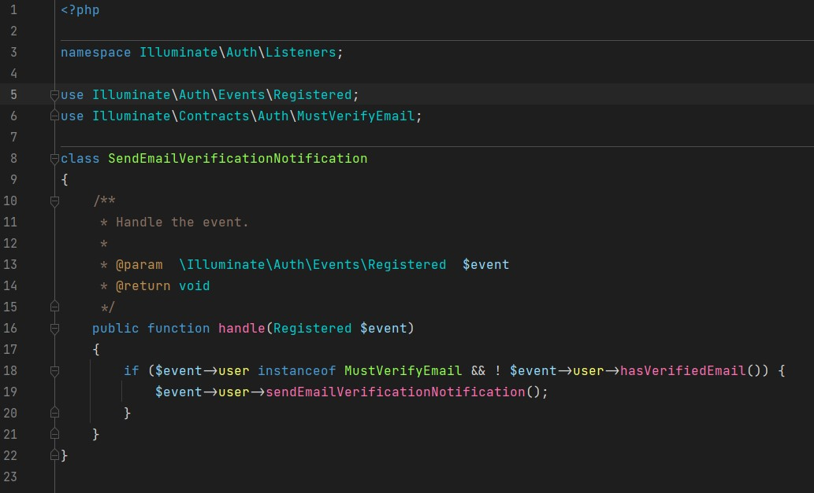
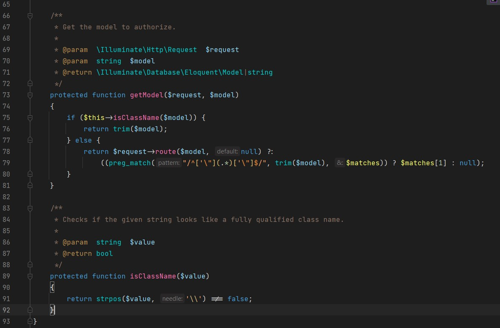

# DarkEnjoyable PHPStorm Color Scheme

DarkEnjoyable has an enjoyable color scheme based on pastel shades

## DarkEnjoyable Style ##

### Screenshots V2 ###
##### image 1 #####

##### image 2 #####

## Installation ##

- Download the `DarkEnjoyable.icls` file
- In `File` -> `Settings` -> `Editor` -> `Colors Scheme` Select the gear and then select `Import Scheme`
- Select the file `DarkEnjoyable.icls` you downloaded
- Press `Apply` button
- Enjoy

# Contribute

Feel free to contribute 
